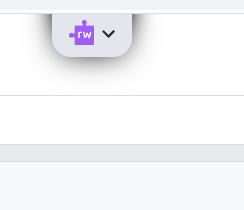

# RW-Popup-Remover-chrome-extension
___

### This thing:

- Is annoying
- Is useless
- Contributs nothing to society

You can't disable it because it is installed by the school (on school computers that is).  
This extension will brutally remove it from the DOM. 